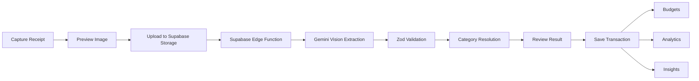

<div align="center">

# Slipzen

**Turn receipts into structured expenses, budgets, and useful spending insights.**

Slipzen is a cross-platform personal finance and receipt management app built with React Native and Expo. It combines receipt capture, AI-powered data extraction, expense tracking, budgeting, and analytics in one end-to-end mobile workflow.

</div>

---

## Overview

Most expense trackers still rely on users entering every transaction manually. Slipzen reduces that friction by using the receipt itself as the starting point.

A user can capture a receipt, upload it securely, extract structured transaction data with AI, review the result, save the expense, and then use that data across budgets and analytics.

```text
Receipt
  ↓
Capture / Upload
  ↓
Secure Storage
  ↓
AI Extraction
  ↓
Validation & Category Resolution
  ↓
User Review
  ↓
Transaction
  ↓
Budget + Analytics + Insights
```

## Key Features

### AI Receipt Scanning
- Capture receipts directly from the device camera.
- Upload receipt images to Supabase Storage.
- Process receipts through a Supabase Edge Function.
- Extract merchant, total amount, date, purchased items, payment method, suggested category, and confidence score with Gemini.
- Validate AI responses with Zod before they enter the application flow.
- Review extracted data before saving the transaction.

### Expense & Transaction Management
- Add and manage expenses.
- Browse transaction history.
- Organize spending using categories.
- Resolve AI category suggestions against the app's existing categories.

### Budgets
- Create category-based budgets.
- Track spending against budget limits.
- Reuse transaction data across the budgeting experience.

### Analytics & Insights
- Visualize spending data with mobile-friendly charts.
- Explore spending patterns across transactions and categories.
- Generate higher-level financial insights through a dedicated backend function.

### Mobile Experience
- File-based navigation with Expo Router.
- Animated interactions with React Native Reanimated.
- Camera, image processing, haptics, notifications, and secure local storage through Expo APIs.
- Designed as a native mobile experience for iOS and Android.

---

## End-to-End Receipt Flow

The receipt pipeline is the core workflow of Slipzen.



The mobile client never needs to expose the Gemini API key. Receipt processing is handled server-side through Supabase Edge Functions, while authenticated requests are tied to the current Supabase session.

---

## Architecture

Slipzen uses a feature-oriented React Native structure so UI, domain logic, data access, and backend integrations remain separated as the app grows.

```text
Slipzen/
├── app/                  # Expo Router screens and navigation
│   ├── (auth)/           # Authentication routes
│   ├── (tabs)/           # Main application tabs
│   ├── budget/           # Budget screens
│   ├── categories/       # Category screens
│   ├── expense/          # Expense flows
│   └── scan/             # Receipt capture → review pipeline
│
├── components/           # Shared UI components
├── features/             # Feature/domain logic
│   ├── analytics/
│   ├── auth/
│   ├── budgets/
│   ├── categories/
│   ├── insights/
│   ├── receipts/
│   └── transactions/
│
├── lib/                  # Shared clients and infrastructure
├── stores/               # Zustand application state
├── theme/                # Design tokens and styling system
└── supabase/
    ├── functions/        # Server-side Edge Functions
    ├── migrations/       # Database migrations
    └── schema-combined.sql
```

### Data Flow

```text
React Native UI
      ↓
Feature Hooks / Zustand
      ↓
TanStack Query
      ↓
Supabase
 ┌────┼──────────────┐
 ↓    ↓              ↓
Auth  PostgreSQL     Storage
                       ↓
                Edge Functions
                       ↓
                  Gemini API
```

---

## Tech Stack

| Area | Technology |
| --- | --- |
| Mobile | React Native 0.81 |
| Framework | Expo SDK 54 |
| Navigation | Expo Router |
| Language | TypeScript |
| Backend | Supabase |
| Database | PostgreSQL via Supabase |
| Authentication | Supabase Auth |
| File Storage | Supabase Storage |
| Server Functions | Supabase Edge Functions / Deno |
| AI | Google Gemini |
| Server State | TanStack React Query |
| Client State | Zustand |
| Validation | Zod |
| Animation | React Native Reanimated |
| Charts | react-native-gifted-charts |
| Device APIs | Expo Camera, Image Picker, Image Manipulator, Haptics, Notifications |

---

## Getting Started

### Prerequisites

- Node.js
- npm
- Expo-compatible development environment
- A Supabase project

### 1. Clone the repository

```bash
git clone https://github.com/7sadakonr/Slipzen.git
cd Slipzen
```

### 2. Install dependencies

```bash
npm install
```

### 3. Configure environment variables

Copy the example environment file:

```bash
cp .env.example .env
```

Then configure:

```env
EXPO_PUBLIC_SUPABASE_URL="YOUR_SUPABASE_URL"
EXPO_PUBLIC_SUPABASE_PUBLISHABLE_KEY="YOUR_SUPABASE_ANON_KEY"
```

### 4. Configure Supabase

Apply the database schema/migrations in the `supabase/` directory and configure the required Storage bucket and Edge Functions.

The receipt scanning function requires a Gemini API key stored as a Supabase secret:

```text
GEMINI_API_KEY
```

Do not expose this key through `EXPO_PUBLIC_*` environment variables.

### 5. Start the app

```bash
npm start
```

Platform shortcuts:

```bash
npm run android
npm run ios
npm run web
```

---

## Receipt Processing Details

The current scanning pipeline performs the following steps:

1. Capture and prepare the receipt image on the mobile client.
2. Upload the image to the `receipts` Supabase Storage bucket.
3. Invoke the authenticated `scan-receipt` Edge Function.
4. Download the stored receipt server-side.
5. Send the image to Gemini for structured extraction.
6. Parse merchant, amount, date, items, payment method, category suggestion, and confidence.
7. Validate the response on the client with Zod.
8. Resolve the suggested category against available application categories.
9. Present the extracted result for user review.
10. Save the confirmed data into the finance workflow.

This keeps AI secrets outside the mobile bundle and gives the app a clear boundary between device-side UX and server-side receipt processing.

---

## Engineering Highlights

- **End-to-end product flow** — connects device camera input to backend processing, persistent data, budgeting, and analytics.
- **Feature-oriented codebase** — domain logic is grouped by capability instead of placing the entire app inside route files.
- **Server-side AI integration** — Gemini credentials remain inside Supabase Edge Functions rather than the mobile client.
- **Schema validation** — AI-generated output is validated before being consumed by application logic.
- **State separation** — TanStack Query handles remote/server state while Zustand manages focused client-side workflow state.
- **Cross-platform architecture** — a single Expo/React Native codebase targets iOS and Android.

---

## Roadmap

- [ ] Import and attach electronic receipts from files/images.
- [ ] Expand receipt item-level analytics.
- [ ] Improve automatic merchant/category matching.
- [ ] Add automated unit, integration, and end-to-end tests.
- [ ] Add CI checks for type safety and test coverage.
- [ ] Prepare production preview/release builds with EAS.

---

## License

This project is licensed under the [MIT License](LICENSE).

---

<div align="center">

Built as an end-to-end mobile product exploring **React Native, AI-assisted receipt processing, backend integration, and personal finance UX**.

</div>
